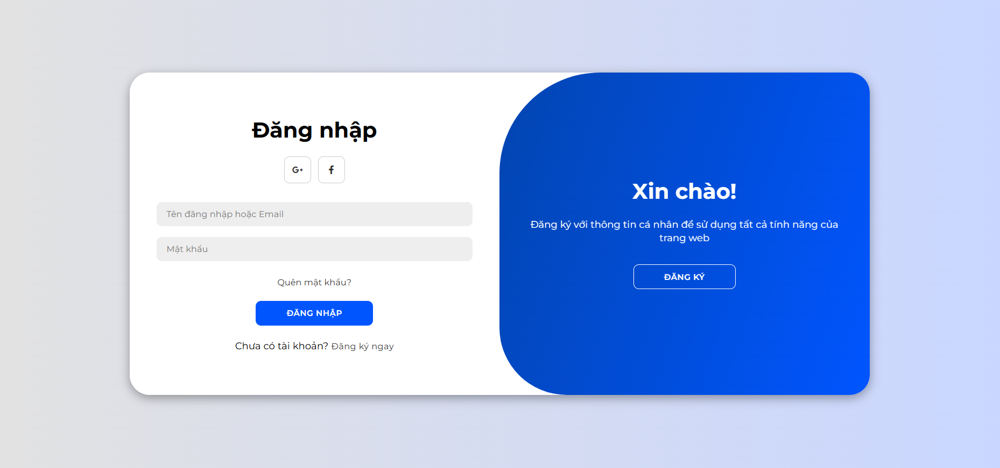
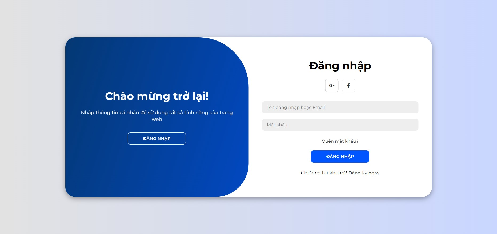
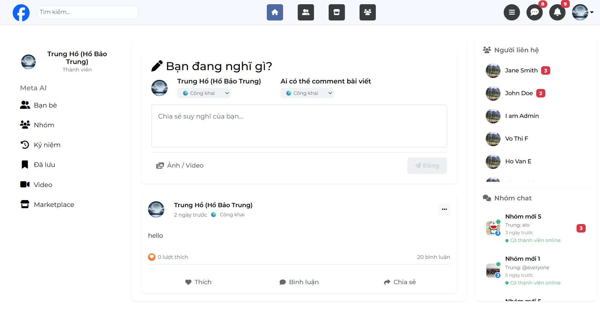
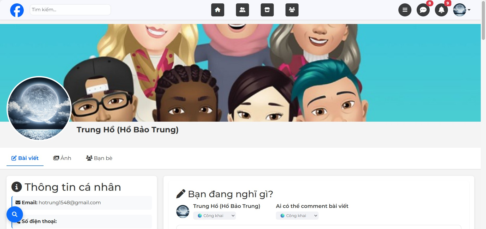
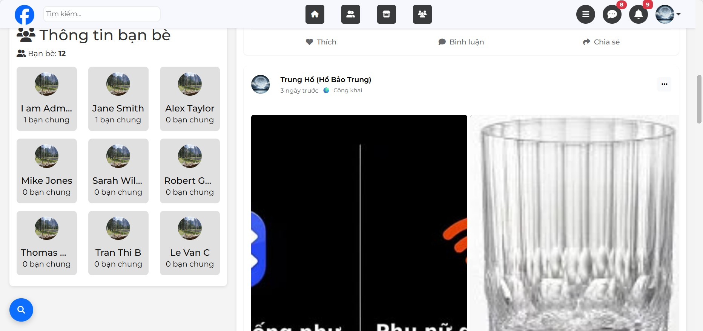
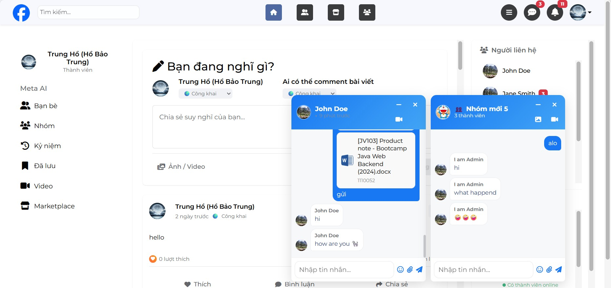
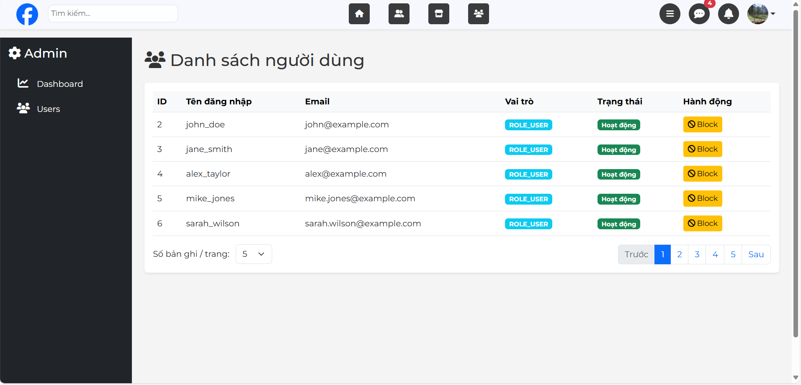

# 📱 Social Media Platform

A **Social Media Platform** built with **Spring Boot** and **Thymeleaf**.  
The application enables users to connect, share, chat, and interact in real time.  
It also provides an admin dashboard to manage users and monitor system activities.

---

## 🚀 Tech Stack

- **Backend**: Spring Boot (Spring MVC, Spring Data JPA, Spring Security, OAuth2)
- **Frontend**: Thymeleaf, Bootstrap 5, CSS, JavaScript (AJAX)
- **Realtime**: WebSocket (chat, notifications)
- **Database**: MySQL
- **Authentication**: Spring Security + OAuth2 (Facebook, Google)
- **Build Tool**: Gradle
- **Others**: Lombok, Hibernate Validator, REST API

---

## ✨ Features

### 👤 Guest/User Authentication
1. Register a new account
2. Login with system account
3. Login with Facebook/Google
4. Update personal profile
5. Change password
6. View another user’s profile
7. Logout

### 👥 Friend Management
8. Send friend request
9. Remove a friend
10. Cancel a sent friend request
11. View friend list
12. View mutual friends
13. Control privacy of friend list

### 📝 Status/Posts
14. View friend’s timeline
15. Post a status on timeline
16. View own statuses
17. Edit status
18. Delete status
19. Attach images to status
20. Edit images in status
21. Remove images from status
22. Search own statuses
23. Set visibility (Public/Friends/Private)
24. View non-private statuses of friends
25. View public statuses of other users

### 💬 Comments
26. Comment on friend’s status
27. View comments in a status
28. Edit comment
29. Delete comment
30. See number of comments on a status
31. Restrict strangers from commenting

### 👍 Likes
32. Like a status
33. Unlike a status
34. See real-time like count of status
35. Like a comment
36. Unlike a comment
37. See like count of a comment

### 🔧 Admin
38. View all users
39. Block a user account
40. Track app visits
41. Track new registered users

### 🔔 Notifications
42. Receive notifications for new activities
43. Show number of unread notifications
44. Navigate to content from notifications

### 💬 Chat & Video Call
45. Create a group chat
46. Send messages in group chat
47. View chat history
48. Mention users in chat (@tag)
49. Send files in chat
50. Video call with friends (WebRTC/WebSocket)
---
## 🖼️ Screenshots

### 🔑 Login/Resgister Page


### 🏠 Home / News Feed

### 👍 Like & 💬 Comment

### 👤 Profile Page


### 💬 Chat Feature

### 🔧 Admin Dashboard

---

## 📂 Project Structure

### Java Source (com.codegym.socialmedia)

- **annotation**: Contains custom annotations used in the application.

- **component**: Houses reusable components.

- **config**: Configuration classes for the application (Spring Security, WebSocket, etc.).

- **controller**: Controller classes handling HTTP requests and defining endpoints.

- **dto**: Data Transfer Objects for API communication between layers.

- **generalInterface**: Interface definitions for general use.

- **model**: Entity classes representing the database models.

- **repository**: Repository interfaces for database operations using Spring Data JPA.

- **service**: Service layer implementing business logic.

- **ErrAccountException.java**: Custom exception class for account-related errors.

- **SocialMediaApplication.java**: The main Spring Boot application class.


### Resources
- **static/css**: CSS files for styling.

- **static/images**: Image assets.

- **static/js**: JavaScript files.

- **templates/admin**: Templates for admin-related pages.

- **templates/fragments**: Reusable HTML fragments.

- **templates/friend**: Templates for friend-related pages.

- **templates/profile**: Templates for profile pages.

- **templates/login.html**: Login page template.

- **templates/news-feed.html**: News feed page template.

- **application.properties**: Main configuration file.
- **secret.properties**: Some key configuration file
- **application-dev-secret.properties**: Information of properties files.  

## Getting Started

### Clone the Repository

Use the following command to clone the repository:

```bash
git clone https://github.com/HoBaoTrung/team_social_media.git
```
### Create and Configure the application-dev-secret.properties File
 1. Copy the provided application-dev-secret.properties template.
 2. Update the file with your specific settings, such as database credentials and API keys.

### Run the Project
You can run the project using one of the following methods:
1. Checkout to Develop Branch
2. Use your preferred IDE (e.g., IntelliJ, Eclipse).
Alternatively, run the following command from the terminal
3. Pull Redis from Docker Hub and run Docker container
```bash 
docker run -d --name redis-server -p 6379:6379 redis
```
4. Execute the SQL Example Data

## Sample Data Description

To help you get started with testing the application, the provided SQL script includes sample user data with predefined `username` and `password` for both regular users and admin users. Below is an example of the data structure:

| Role       | Username       | Password       |
|------------|----------------|----------------|
| Regular User | `john_doe`       | `12345`  |
| Regular User | `jane_smith`       | `12345`      |
| Admin       | `admin1`       | `12345` |

### Notes:
- **Regular User**: These accounts have standard access to the application features.
- **Admin**: This account has elevated privileges, including access to administrative functions.
- Ensure that you update the `application-dev-secret.properties` file with the appropriate database credentials to connect to the database and some key.

### Steps to Use Sample Data
1. Run the SQL script (`example-data.sql`) to populate the database.
2. Log in to the application using the credentials listed above to test different user roles.

